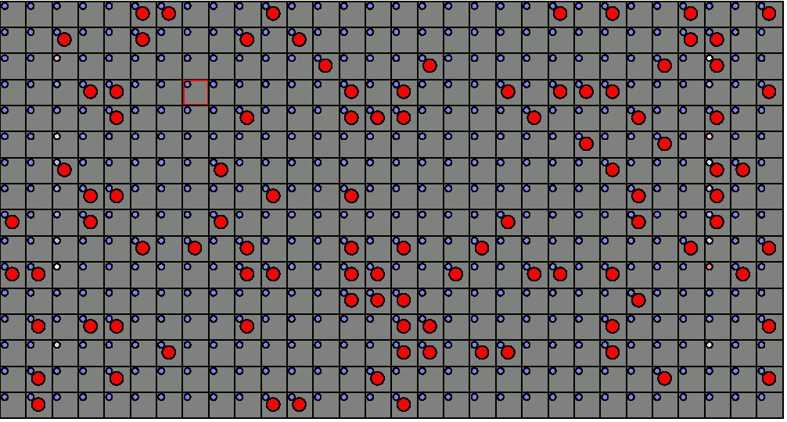

## Developing a fully convolutional Minesweeper model

This project is about the development of a neural network to play Minesweeper. This involved the following steps:
* Implementation of the logic of Minesweeper
    * Once in Python, including a minefield editor, a GUI, and model integration
    * And a threaded C++ implementation to accelerate generation of training data
* Generation of a set of unbiased state-action pairs for training a model
* Development of methods for training and evaluating models

The result was a model that makes safe moves 99.6% of the time, wins 41.1% of games played, and makes 178 consecutive safe moves on average on expert puzzles (16x30 grid with 99 mines), provided the random move at the beginning is safe. These numbers were obtained by averaging the results of 3000 randomly initialized expert puzzles.

Check this out! The model playing in the gif and the associated code are available in src/



## Getting Started

Before getting into detail on how all this works, a few details on how to proceed with compiling and running everything because I haven't made it particularly user-friendly yet :D

1) Compile and run the dataset generator, head to the src/ directory and run:
    ```
    g++ minesweeper_main.cpp -o minesweeper -lpthread -O3
    ```
   
    Once compiled, you'll build your datasets using the following parameter scheme

    ```
    ./minesweeper [rows] [cols] [mines] [desired number of samples] [execution threads]
    ```

    As an example, you might run the two lines below to generate your training and validation sets using 8 threads. 

    ```
    ./minesweeper 16 30 99 1000000 8 > training
    ./minesweeper 16 30 99 100000 8 > validation
    ```

    * Note: that I wrote this on a linux machine and it compiles and runs fine on windows, but threading doesn't work yet in windows, so it seems fastest to run in 1 thread for now unless you're on a linux machine. I'll fix that at some point.
    * Note: defaults for grid size and number of mines are defined in common.py, so make sure they match the dimensions of the dataset you generate.

2) Train a model on the generated datasets

    ```
    python train.py training validation
    ```

    This will take a while, depending on your hardware, but trained models will start popping out. You may need to adjust the batch size depending on how much memory you have available. There will also be a progress report after each training round so you can see how everything's going.

3) Evaluate a trained model

    ```
    python evaluate.py "minesweeper model 16x30x99"
    ```
    
    Running evaluate.py with a model will give you some cryptic output about win rates and safe move rates and likelihood that a random sampler would get the same results and stuff like that. It's pretty cool :D

4) Play a game in a GUI with model integration

    To play without model integration, just run the play script
    
    ```
    python play.py
    ```
    
    To play *with* model integration, include the path to a trained model
    
    ```
    python play.py "minesweeper model 16x30x99"
    ```
    
    * Note: models only work on the grid size they were trained on (for now)

## Overview

### Problem Definition

The goal is to train a neural network to predict safe moves in games of minesweeper.

### Technical Considerations

**Data Representation**

Minesweeper is a 2D game where each cell can be mined, flagged, visited, or unvisited, but it's the layer that specifies the number of nearby mines that contains the information. 

Here's my thought process: 
* Discrete numbers can be represented as binary features in separate channels in the input
* Unvisited cells can be represented by not setting any values for unvisited positions
* The numbers 0-8 will cover all likely scenarios, but I'll throw in a channel for 9 ;)

The result is a binary input with shape [None][r][c][10] where r=rows, c=cols, and 10 is the number of channels (and None is the sample dimension).

**Training Objective**

So what am I trying to predict, anyway? This took some trial and error because concepts like bias started seeping in. Anyway, the major approaches were as follows:

1) There's a false equivalence here, but my first attempt was modeled after computer Go models like AlphaGo where I'd train the model to select *a* good move and then apply a softmax and use categorical crossentropy as my loss (even though Minesweeper isn't "that kind" of game).

2) The more successful approach was to have the model predict all safe moves in one go. So now we're using a sigmoid activation instead of a softmax and we're using a binary crossentropy loss instead of a categorical one. That's basically the current state of things.

### Concepts

**Bias**

I had a bias problem with the first version of my Minesweeper model and I had basically already written the next version before I realized what that bias was. It took me a while to notice because it's kind of subtle, but the reader may figure it out before I get to the punchline.

There's a sampling bias hidden in the following conditions:
* Start with a randomly initialized model
* Train the model on reward signals from its experience
* Allow the model to make completely random moves

Have a think if it hasn't hit you yet...

So I'll get on with it. I'm pretty sure the bias showed up in the last step where the model was allowed to make completely random decisions. This means it was allowed to select cells about which it had no information what-so-ever. This is an oversight because, in Minesweeper, an expert puzzle is 16x30 with 99 mines. That's 99 mines for 480 cells or roughly 20% mines. This means that if you pick a random cell and have no information available about it, you'll be safe roughly 80% of the time, but you won't have any features to associate that with. Your model is learning that it'll have a decent chance of being safe in the next move if it just takes a stab in the dark! That may work for a few moves, but it won't work for 150+ moves that are necessary for solving an expert puzzle.

It's entirely possible, and maybe even likely, that my model would have learned to stick with border cells eventually, but it proves a point at the very least. As a developer, I could have guided the model to make random selections about cells it had information about, for example. I may come back to that.

## Methods/Results:

Now that I've completed the process and figured out what works, I'll write it down as though I planned it this way :D

### Step 1: Acquire Training Data

**Sampling**

We obviously needs scads of data to train a model and Minesweeper puzzles are simple and cheap to generate, so there's no real need for augmentation. The process still needs to be fast, though, so I wrote a multithreaded C++ console application to generate a specified number of puzzles with specified properties. These puzzles are written to stdout and can be redirected to files as shown above.

This data generator does the following steps (on a per-thread basis):
1) Initializes a random game of Minesweeper
2) Advances through the game, making guaranteed safe moves
3) At each move, the game state and all safe "border" moves are labeled
4) After playing the game to completion, saves a single, random frame from the game

A million frames are generated in this way for separate training and validation sets and I can tell you a Threadripper makes short work of that!

**Representation**

We need a way of encoding frames once they've been generated. I've done this as follows:

* Numbers 0-9 count proximal mines
* Question Mark (?) is used to represent unvisited cells
* Exclamation Mark (!) is used to represent mines
* The letter "s" is used to represent safe moves

The following example was generated from a 10x10 grid with 12 mines.

s101s1001!!101!1001s111221011s001!s111!s0012s!sss!0001!s1s??1212111s??!2!1001!??sss2111s????s1!sss??

Looking at this a little differently, you can see the puzzle! (sort of, eheh...)

    s 1 0 1 s 1 0 0 1 !
    ! 1 0 1 ! 1 0 0 1 s
    1 1 1 2 2 1 0 1 1 s
    0 0 1 ! s 1 1 1 ! s
    0 0 1 2 s ! s s s !
    0 0 0 1 ! s 1 s ? ?
    1 2 1 2 1 1 1 s ? ?
    ! 2 ! 1 0 0 1 ! ? ?
    s s s 2 1 1 1 s ? ?
    ? ? s 1 ! s s s ? ?

So in this case, we're training a model to take this string, reshape it to the right dimensions, encode everything that has a numerical value and predict all the values marked as safe.
 
### Step 2: Designing the Model

The model architecture is based on the data representation and the training objective. As described above, I settled on a 3D binary representation of the minefield in which the third dimension represents the number of mines proximal to a particular position and a 2D output layer into which the estimated safety of each position is projected.

**Notes**

I'll introduce a few concepts and then narrate the model-building code with fancy comments ;D

* Using padded convolutions

    The normal mode of operation for convolutions is for the receiving surface to be smaller than the originating surface. This change in dimensionality basically precludes the possibility of accurately localizing features of interest in the input (same reason we don't use pooling layers unless we can carry that positional information through some other way -- looking at you, Inception Block!).
        
    Anyway, Minesweeper is a game where we're literally navigating a figurative minefield, so accuracy and precision need to be preserved. This is done by padding our convolutions by exactly the amount that would be removed during application of that layer, thereby preserving the original feature shape as we move through our hidden layers.
    
    Another place I've used padded convolutions: a neural part-of-speech tagger I trained. How about that!

* Using residual connections

    My Minesweeper model isn't particularly deep. It's only 20 convolutional layers for the expert puzzle, but the Sudoku model is significantly deeper at like 100 convolutional layers, so this is more relevant there. In any case, I've grown accustom to using residual connections for any shape-preserving model deeper than just a few layers.
    
    Residual connections were developed "ages" ago and enable the training of exceptionally deep models by providing a more direct route for updating weights that are far away from the point of origin of an update signal.
    
* Using a sigmoid activation with a binary crossentropy loss

    Just to make a note that the output activation and the loss functions are different in a case like this than they are in a "categorization" problem where there's only one right answer. 
    
    * When there's one right answer
    
        You're setting the activation to 1 on one specific neuron, so you'll be aiming for softmax and categorical crossentropy.

    * When there can be many right answers
    
        You're potentially setting many values to 1 and many to 0, so softmax won't get you there. You're looking for sigmoid and binary crossentropy.

**Model Code**

I've basically settled on a ResNet, sans-pooling layers. I need to preserve the input shape because I'm making "per-pixel" predictions about where it's safe to step. So, to that end, start by pulling in some basic hyperparameters.

```
def build_2d_model(filters, kernels, blocks):
    """Build a model to play minesweeper!"""
```

Next, we specify the input shape with variables from common.py. It's clear that we're expecting a 3D input shape per sample.

```
    # Here, we're taking a 3D input in the form of a 2D grid with multiple channels
    # The channels are my way of representing discrete numbers to the model (how many nearby cells are mined?)
    inputs = Input(shape=(GRID_R, GRID_C, CHANNELS))
```

We're looking to build residual connections between blocks, so we'll start by projecting into the dimensionality that will be maintained throughout the hidden states (e.g. [GRID_R][GRID_C][CHANNELS] -> [GRID_R][GRID_C][filters])

```
    # Start by projecting into a different 3D space so we can start using residual connections right away
    x = Conv2D(filters=filters, kernel_size=kernels, padding='same')(inputs)
    x = BatchNormalization()(x)
    x = Activation('relu')(x)
    x = Dropout(0.2)(x)
```

Add the specified number of residual blocks.
    
```
    # Do this over and over... the Add() is our residual connection
    for _ in range(blocks):
        y = Conv2D(filters=filters, kernel_size=kernels, padding='same')(x)
        y = BatchNormalization()(y)
        y = Activation('relu')(y)
        y = Dropout(0.2)(y)

        y = Conv2D(filters=filters, kernel_size=kernels, padding='same')(y)
        y = BatchNormalization()(y)
        y = Activation('relu')(y)
        y = Dropout(0.2)(y)
        x = Add()([x, y])
```

I'll just refer to my commented code on this one ;)

```
    # Project into a space that "squeezes" to 2D and apply a sigmoid to map from 0 to 1
    # This 0 to 1 mapping works well with the binary_crossentropy loss function, because...
    # We're predicting which cells are safe and that's more of a multi-out regression than a classification
    outputs = Conv2D(filters=1, kernel_size=(1, 1), padding='same', activation='sigmoid')(x)

    model = Model(inputs=inputs, outputs=outputs)
    model.compile(loss='binary_crossentropy', optimizer=Adam(lr=0.0002), metrics=['accuracy'])
    return model
```

### Step 3: Training the Model

We've already done the training/validation split by generating separate files for those and keeping them separate in code.

This part is all pretty straightforward. The code can be found near the bottom of train.py

### Step 4: Evaluating the Model


### Final Stage: Playing some vidja games

